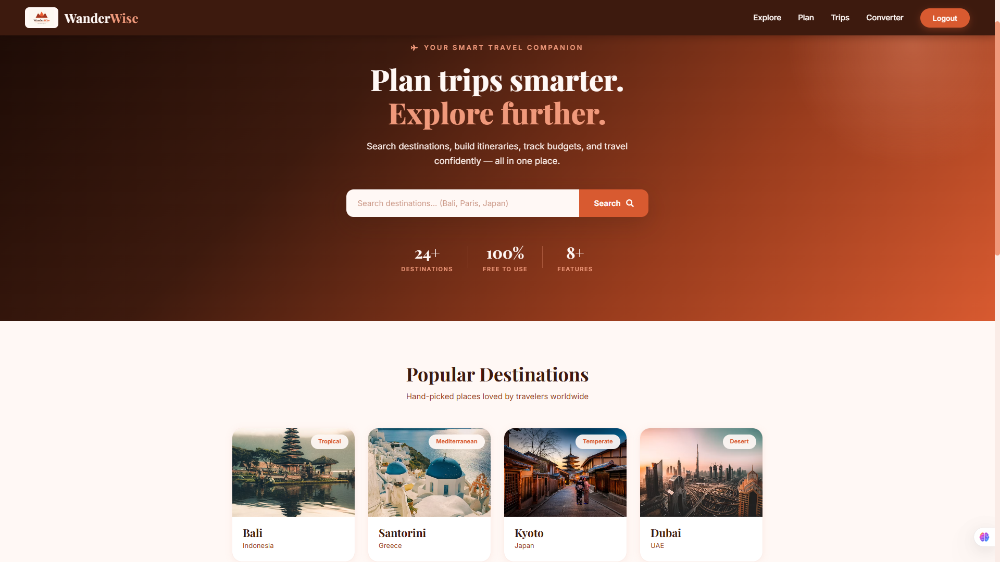
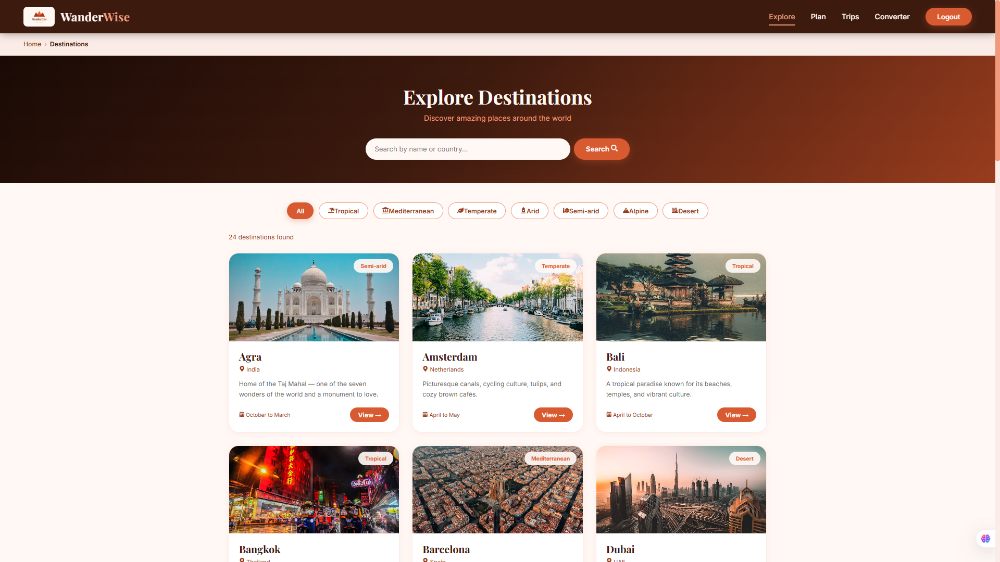
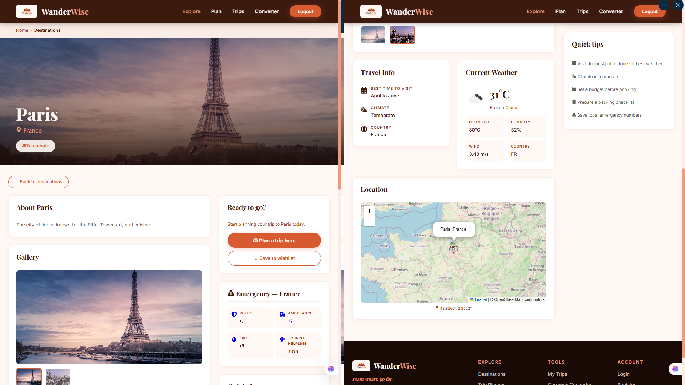
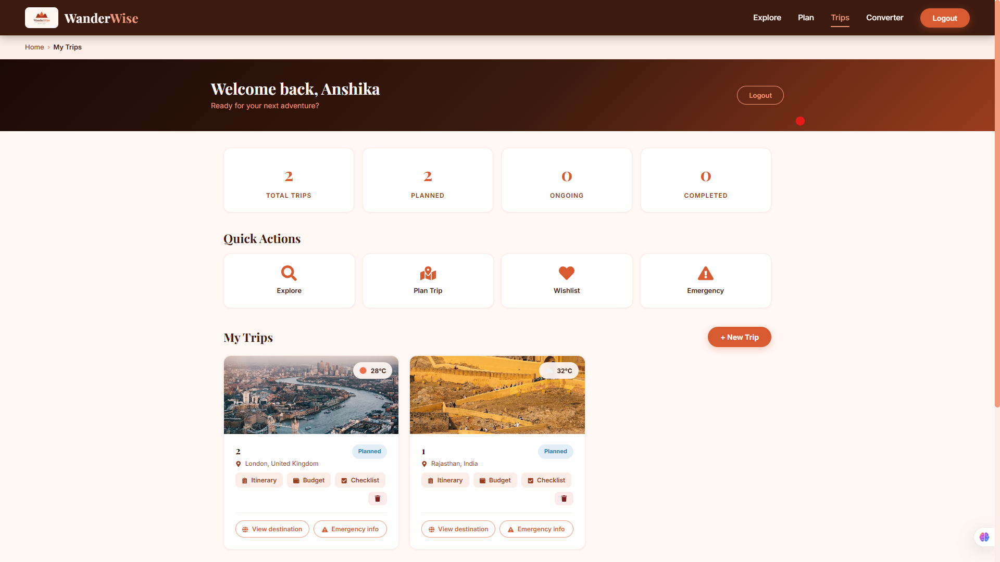

<div align="center">

# 🏔️ WanderWise

### roam smart. go far.

**A full-stack travel planning platform — search destinations, build itineraries, track budgets, and travel confidently, all in one place.**

[**🌐 Live Demo**](https://wanderwise-roam-smart-go-far.vercel.app) · [**API**](https://wanderwise-roam-smart-go-far.onrender.com)


</div>

---

## ✨ Preview

| Home | Explore Destinations |
|---|---|
|  |  |

| Destination Detail | Dashboard |
|---|---|
|  |  |

---

## 🚀 Features

- **🔐 Authentication** — JWT-based register/login with bcrypt password hashing
- **🌍 24+ Destinations** — searchable, filterable by climate, with real photography and live data
- **🌤️ Live Weather** — current conditions for every destination via OpenWeatherMap
- **🗺️ Interactive Maps** — Leaflet.js maps pinned to each destination
- **🧳 Trip Planning** — create trips linked to destinations with dates and status tracking
- **📋 Day-by-Day Itineraries** — plan activities with times and notes, grouped by day
- **💰 Budget Tracking** — set trip budgets, log categorized expenses, visual progress bar
- **✅ Smart Checklists** — categorized packing lists with progress tracking and quick-add suggestions
- **❤️ Wishlist** — save dream destinations for later
- **🚨 Emergency Contacts** — police/ambulance/fire/tourist-helpline numbers for 19 countries, tap-to-call, auto-matched to your trip's destination
- **💱 Currency Converter** — live exchange rates for 13 currencies
- **📧 Email Reminders** — automated Nodemailer + cron job emails 3 days before each trip starts
- **📱 Fully Responsive** — designed for desktop and mobile with a custom Sunset Coral theme

## 🛠️ Tech Stack

| Layer | Technology |
|---|---|
| **Frontend** | React 18 (Vite), React Router, CSS Modules, react-icons, Axios |
| **Backend** | Node.js, Express.js |
| **Database** | MongoDB Atlas + Mongoose |
| **Auth** | JSON Web Tokens, bcrypt |
| **APIs & Libraries** | OpenWeatherMap, open.er-api (currency), Leaflet.js, Nodemailer, node-cron |
| **Deployment** | Vercel (frontend) · Render (backend) · MongoDB Atlas (database) |

## 🏗️ Architecture

```
WanderWise/
├── client/                  # React frontend (Vite)
│   ├── src/
│   │   ├── components/      # Navbar, Footer, Breadcrumbs, CurrencyConverter...
│   │   ├── pages/           # Home, Destinations, Dashboard, Budget, Itinerary...
│   │   ├── styles/          # theme.css (design tokens) + CSS Modules per page
│   │   └── services/        # Axios instance with JWT interceptor
│   └── vercel.json          # SPA route rewrites
└── server/                  # Express backend
    ├── config/              # MongoDB connection
    ├── controllers/         # Route handlers
    ├── middleware/          # JWT auth guard
    ├── models/              # Mongoose schemas
    ├── routes/              # API route definitions
    ├── utils/               # Nodemailer + trip reminder cron job
    └── seed.js              # 24 destinations + 19 countries of emergency data
```

## ⚡ Getting Started

### Prerequisites
- Node.js 18+
- A MongoDB Atlas cluster (free tier works)
- Gmail account with an [App Password](https://support.google.com/accounts/answer/185833) (for email reminders)
- [OpenWeatherMap](https://openweathermap.org/api) API key (free)

### 1. Clone & install

```bash
git clone https://github.com/devAnshikaAggarwal/WanderWise-travel-planner.git
cd WanderWise-travel-planner

# backend
cd server && npm install

# frontend
cd ../client && npm install
```

### 2. Configure environment

Create `server/.env` (see `server/.env.example`):

```env
MONGO_URI=your_mongodb_connection_string
JWT_SECRET=any_long_random_string
OPENWEATHER_API_KEY=your_openweathermap_key
EMAIL_USER=your@gmail.com
EMAIL_PASS=your_16_char_gmail_app_password
```

### 3. Seed the database

```bash
cd server
node seed.js
```

### 4. Run

```bash
# terminal 1 — backend (http://localhost:5000)
cd server && node server.js

# terminal 2 — frontend (http://localhost:3000)
cd client && npm run dev
```

## 📡 API Overview

| Endpoint | Description |
|---|---|
| `POST /api/auth/register` · `POST /api/auth/login` | Authentication |
| `GET /api/destinations` | Destinations (supports `?search=`) |
| `GET/POST/PUT/DELETE /api/trips` | Trip CRUD (protected) |
| `GET/POST /api/itinerary/:tripId` | Day-by-day activities |
| `GET/POST /api/budget/:tripId` | Budgets and expenses |
| `GET/POST/PUT /api/checklist/:tripId` | Packing checklist |
| `GET/POST/DELETE /api/wishlist` | Wishlist |
| `GET /api/emergency?country=` | Emergency numbers by country |
| `GET /api/weather?city=` | Live weather |
| `GET /api/currency/convert?from=&to=&amount=` | Currency conversion |

## 👩‍💻 Author

**Anshika Aggarwal**
GitHub: [@devAnshikaAggarwal](https://github.com/devAnshikaAggarwal)

---

<div align="center">

*WanderWise — roam smart. go far.* 🏔️

</div>
